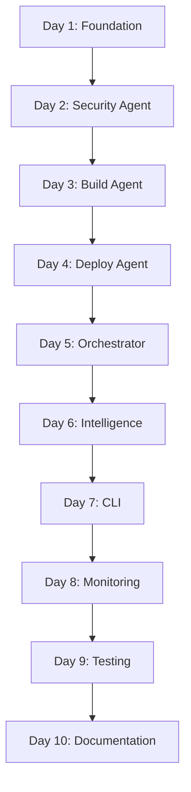

# DeployMind - Comprehensive Task List (2-Week Plan)

Based on: `docs/project/2-week-plan.md`

Format: `Task#<number> - <Description> [Day X] {Status}`

---

## WEEK 1: FOUNDATION & CORE AGENTS

### DAY 1: Setup & Architecture ✅
- [x] **Task#1**: Implement core data models (Pydantic + SQLAlchemy) [Day 1] {COMPLETE}
- [x] **Task#2**: Implement AWS EC2 client with real operations [Day 1] {COMPLETE}
  - Added SSM command execution (run_command, check_ssm_agent_status)
- [x] **Task#3**: Implement GitHub client with real API operations [Day 1] {COMPLETE}
  - Added clone_repository and get_file_content methods
- [x] **Task#4**: Implement Redis client for agent communication [Day 1] {COMPLETE}
- [x] **Task#5**: Set up database models (6 tables) [Day 1] {COMPLETE}
- [x] **Task#6**: Configure dependency injection [Day 1] {COMPLETE}
- [x] **Task#7**: Write comprehensive tests for Day 1 [Day 1] {COMPLETE}
  - 22 unit tests, all passing

**Status**: 7/7 tasks complete (100%) ✅

---

### DAY 2: Security Agent ✅
- [x] **Task#8**: Implement Trivy scanner integration [Day 2] {COMPLETE}
- [x] **Task#9**: Implement Security Agent with CrewAI [Day 2] {COMPLETE}
- [x] **Task#10**: Create security scan use case [Day 2] {COMPLETE}
  - Implemented SecurityScanUseCase with full workflow orchestration
  - 6 comprehensive unit tests, all passing
- [x] **Task#11**: Write comprehensive tests for Security Agent [Day 2] {COMPLETE}

**Status**: 4/4 tasks complete (100%) ✅

---

### DAY 3: Build Agent ✅
- [x] **Task#12**: Implement language detector [Day 3] {COMPLETE}
  - Detects 5 languages: Python, Node.js, Go, Java, Ruby
  - Framework detection (FastAPI, Express, Gin, Spring, Rails)
  - Package manager identification
  - 380 lines of code

- [x] **Task#13**: Implement Dockerfile optimizer (dynamic) [Day 3] {COMPLETE}
  - Dynamic project analysis (not static templates)
  - Dependency parsing and system package detection
  - Environment variable extraction
  - Port scanning from code
  - 659 lines of code

- [x] **Task#14**: Implement Docker builder [Day 3] {COMPLETE}
  - Build, tag, list, inspect, prune operations
  - Streaming build logs
  - Image management
  - 459 lines of code

- [x] **Task#15**: Implement Build Agent with CrewAI [Day 3] {COMPLETE}
  - AI-powered orchestration with Groq LLM
  - Dockerfile quality analysis
  - Optimization recommendations
  - 467 lines of code

- [x] **Task#16**: Write comprehensive tests for Build Agent [Day 3] {COMPLETE}
  - Implemented BuildApplicationUseCase with full workflow
  - 5 comprehensive unit tests, all passing

**Status**: 5/5 tasks complete (100%) ✅

**Code Written**: 2,206+ lines

---

### DAY 4: Deploy Agent ✅
- [x] **Task#17**: Design Deploy Agent architecture [Day 4] {COMPLETE}
- [x] **Task#18**: Implement EC2 deployment operations [Day 4] {COMPLETE}
  - SSM connection to EC2
  - Docker operations: pull_docker_image, deploy_container, stop_container, get_container_status, list_containers
  - Container lifecycle management (graceful shutdown, port management)

- [x] **Task#19**: Implement rolling deployment strategy [Day 4] {COMPLETE}
  - RollingDeployer class with zero-downtime deployment
  - Graceful shutdown of old container
  - Start new container with health validation
  - 15-second initialization delay + 2-minute health checks

- [x] **Task#20**: Implement health check system [Day 4] {COMPLETE}
  - HealthChecker with HTTP, TCP, and command checks
  - Retry logic (5 attempts with 10s delay)
  - Response time tracking and status validation
  - 70% success rate threshold

- [x] **Task#21**: Implement automatic rollback logic [Day 4] {COMPLETE}
  - Automatic rollback on health check failure
  - Manual rollback capability
  - Previous image restoration
  - Error logging and reporting

- [x] **Task#22**: Test Deploy Agent comprehensively [Day 4] {COMPLETE}
  - 18 comprehensive tests, all passing
  - Tests for HealthChecker (HTTP, TCP, command)
  - Tests for EC2Client deployment operations
  - Tests for RollingDeployer (deploy, rollback)
  - Tests for DeployApplicationUseCase (validation, execution)

**Status**: 6/6 tasks complete (100%) ✅

**Code Written**: 1,200+ lines
- infrastructure/monitoring/health_checker.py (394 lines)
- infrastructure/deployment/rolling_deployer.py (472 lines)
- agents/deploy_agent.py (277 lines - enhanced)
- application/use_cases/deploy_application.py (255 lines - rewritten)
- infrastructure/cloud/aws/ec2_client.py (+220 lines - deployment methods)
- tests/test_day4_complete.py (580 lines)

---

### DAY 5: Orchestrator & Integration
- [ ] **Task#23**: Design Orchestrator Agent [Day 5] {Pending}
  - Hierarchical agent structure
  - Task delegation system
  - Sequential execution (security → build → deploy)

- [ ] **Task#24**: Implement task delegation system [Day 5] {Pending}
- [ ] **Task#25**: Implement agent communication via Redis [Day 5] {Pending}
  - Pub/sub for agent events
  - Real-time progress tracking

- [ ] **Task#26**: Implement pipeline error handling [Day 5] {Pending}
  - Security rejection → stop pipeline
  - Build failure → retry then fail
  - Deploy failure → rollback

- [ ] **Task#27**: End-to-end integration testing [Day 5] {Pending}
  - GitHub → EC2 deployment
  - Full pipeline validation

- [ ] **Task#28**: Test failure scenarios [Day 5] {Pending}
  - Bad Dockerfile
  - Health check failures
  - Network issues

**Status**: 0/6 tasks complete (0%)

---

## WEEK 2: INTELLIGENCE, CLI & PRODUCTION-READY

### DAY 6: Agent Intelligence Enhancement
- [ ] **Task#29**: Enhance Security Agent with auto-fix [Day 6] {Pending}
  - Auto-fix common vulnerabilities
  - Generate PR with security fixes
  - Detailed remediation guidance

- [ ] **Task#30**: Enhance Build Agent intelligence [Day 6] {Pending}
  - Detect optimal base images
  - Suggest build optimizations
  - Auto-fix Dockerfile mistakes

- [ ] **Task#31**: Enhance Deploy Agent strategy selection [Day 6] {Pending}
  - Context-aware deployment strategy
  - First deployment vs update logic

- [ ] **Task#32**: Add monitoring integration [Day 6] {Pending}
  - Log events to PostgreSQL
  - Track success rate
  - Store agent decisions

- [ ] **Task#33**: Test enhanced agent intelligence [Day 6] {Pending}

**Status**: 0/5 tasks complete (0%)

---

### DAY 7: CLI Interface
- [ ] **Task#34**: Design CLI with Click framework [Day 7] {Pending}
- [ ] **Task#35**: Implement deploy command [Day 7] {Pending}
  ```bash
  deploymind deploy --repo owner/repo --instance i-123456 --strategy rolling
  ```

- [ ] **Task#36**: Implement status command [Day 7] {Pending}
  ```bash
  deploymind status <deployment-id>
  ```

- [ ] **Task#37**: Implement rollback command [Day 7] {Pending}
  ```bash
  deploymind rollback <deployment-id>
  ```

- [ ] **Task#38**: Implement logs command [Day 7] {Pending}
  ```bash
  deploymind logs <deployment-id> --follow
  ```

- [ ] **Task#39**: Add Rich terminal UI [Day 7] {Pending}
  - Progress bars
  - Colored output
  - Tables for status

- [ ] **Task#40**: Write CLI integration tests [Day 7] {Pending}

**Status**: 0/7 tasks complete (0%)

---

### DAY 8: Logging, Monitoring & Observability
- [ ] **Task#41**: Implement structured JSON logging [Day 8] {Pending}
- [ ] **Task#42**: Create deployment event tracking [Day 8] {Pending}
- [ ] **Task#43**: Implement agent execution metrics [Day 8] {Pending}
  - Execution time
  - Success/failure rates
  - Decision quality

- [ ] **Task#44**: Add performance profiling [Day 8] {Pending}
- [ ] **Task#45**: Create monitoring dashboard [Day 8] {Pending}
  - Deployment history
  - Agent performance
  - System health

**Status**: 0/5 tasks complete (0%)

---

### DAY 9: Testing & Quality Assurance
- [ ] **Task#46**: Achieve 80%+ test coverage [Day 9] {Pending}
- [ ] **Task#47**: Write integration tests [Day 9] {Pending}
- [ ] **Task#48**: Write end-to-end tests [Day 9] {Pending}
  - Full pipeline: GitHub → EC2
  - Multiple test applications

- [ ] **Task#49**: Load testing (10 concurrent deployments) [Day 9] {Pending}
- [ ] **Task#50**: Security audit [Day 9] {Pending}
  - OWASP Top 10 compliance
  - Input validation review
  - Secret management audit

- [ ] **Task#51**: Code review and refactoring [Day 9] {Pending}

**Status**: 0/6 tasks complete (0%)

---

### DAY 10: Documentation & Deployment
- [ ] **Task#52**: Write comprehensive README [Day 10] {Pending}
  - Quick start guide
  - Installation instructions
  - Usage examples

- [ ] **Task#53**: Create architecture documentation [Day 10] {Pending}
  - System diagrams
  - Agent communication flow
  - Data models

- [ ] **Task#54**: Write API documentation [Day 10] {Pending}
- [ ] **Task#55**: Create deployment guides [Day 10] {Pending}
  - AWS setup
  - GitHub configuration
  - API key setup

- [ ] **Task#56**: Record demo video (3-5 minutes) [Day 10] {Pending}
  - Show full deployment
  - Demonstrate rollback
  - Highlight AI decisions

- [ ] **Task#57**: Deploy to Railway/Render free tier [Day 10] {Pending}
- [ ] **Task#58**: Final testing and validation [Day 10] {Pending}

**Status**: 0/7 tasks complete (0%)

---

## Progress Summary

### Week 1 Progress
| Day | Completed | Total | Percentage | Status |
|-----|-----------|-------|------------|--------|
| Day 1 | 7 | 7 | 100% | ✅ Complete |
| Day 2 | 4 | 4 | 100% | ✅ Complete |
| Day 3 | 5 | 5 | 100% | ✅ Complete |
| Day 4 | 6 | 6 | 100% | ✅ Complete |
| Day 5 | 0 | 6 | 0% | **NEXT** ⭐ |

### Week 2 Progress
| Day | Completed | Total | Percentage | Status |
|-----|-----------|-------|------------|--------|
| Day 6 | 0 | 5 | 0% | Not started |
| Day 7 | 0 | 7 | 0% | Not started |
| Day 8 | 0 | 5 | 0% | Not started |
| Day 9 | 0 | 6 | 0% | Not started |
| Day 10 | 0 | 7 | 0% | Not started |

### Overall Progress
- **Completed**: 22/58 tasks (38%)
- **In Progress**: None - Day 1-4 Complete ✅
- **Next Up**: Day 5 - Orchestrator & Integration
- **Code Written**: 3,700+ lines (Days 1-4)
- **Tests Written**: 51 unit tests, all passing (33 Day 1-3 + 18 Day 4)

---

## Next Actions

### Day 5 (Next Priority - CURRENT FOCUS ⭐)
1. **Task#23**: Design Orchestrator Agent
2. **Task#24**: Implement task delegation system
3. **Task#25**: Implement agent communication via Redis

### Critical Path
```
Day 4 (100%) ✅ → Day 5 (Orchestrator) → Day 7 (CLI) → Day 9 (Tests) → Day 10 (Done)
```

---

## Task Dependencies



**Critical dependencies**:
- Deploy Agent needs Build Agent (images to deploy)
- Orchestrator needs all three agents (Security, Build, Deploy)
- CLI needs Orchestrator (to trigger deployments)
- Testing needs everything working

---

## Key Metrics (Target by Day 10)

- [ ] **Functionality**: Full GitHub → EC2 deployment working
- [ ] **Test Coverage**: 80%+ coverage
- [ ] **Performance**: < 5 minute deployment time
- [ ] **Reliability**: Successful rollback on failure
- [ ] **Documentation**: Complete README + architecture docs
- [ ] **Demo**: 3-5 minute video showing full flow

---

**Last Updated**: 2026-02-06
**Current Day**: Day 4 (Deploy Agent) - Day 1-3 Complete ✅
**Status**: Ahead of schedule - Day 1-3 finished with comprehensive tests
